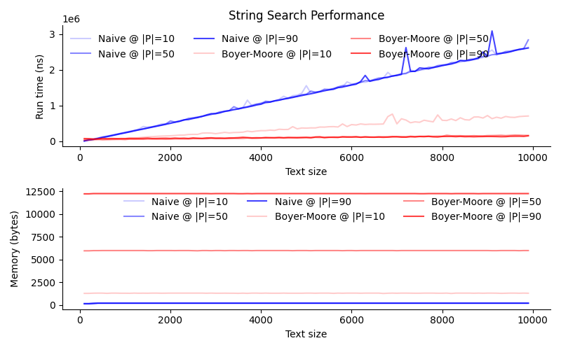

[](https://classroom.github.com/a/08twE9R9)
# string_search
Empirical comparison of naive and Boyer-Moore string search methods.

## Usage
The usages below are provided for the file structure of the repo as given. In your own use cases, adjust paths to the `string_search.py` file to reflect your setup.

## Dependencies
Before using, install dependencies listed in `requirements.txt`
```shell
$ pip install -r requirements.txt
```

## Emperical comparison
```
usage: src/string_search.py [-h] --text_range TEXT_RANGE TEXT_RANGE TEXT_RANGE --pattern_range PATTERN_RANGE PATTERN_RANGE PATTERN_RANGE
                        [--rounds ROUNDS] --out_file OUT_FILE [--width WIDTH] [--height HEIGHT]

options:
  -h, --help            show this help message and exit
  --text_range TEXT_RANGE TEXT_RANGE TEXT_RANGE
                        Text size range (min max increment)
  --pattern_range PATTERN_RANGE PATTERN_RANGE PATTERN_RANGE
                        Pattern size range (min max increment)
  --rounds ROUNDS       Number of rounds to run each algorithm (default: 10)
  --out_file OUT_FILE   File to save plot to
  --width WIDTH         Width of plot in inches (default: 8)
  --height HEIGHT       Height of plot in inches (default: 5)
```

## Examples
```shell
$ python src/string_search.py \
    --text_range 100 10000 100 \
    --pattern_range 10 100 40 \
    --rounds 5 \
    --out_file doc/results/q100-10000-100_p10-100-40_x5.png
```
<center></center>

